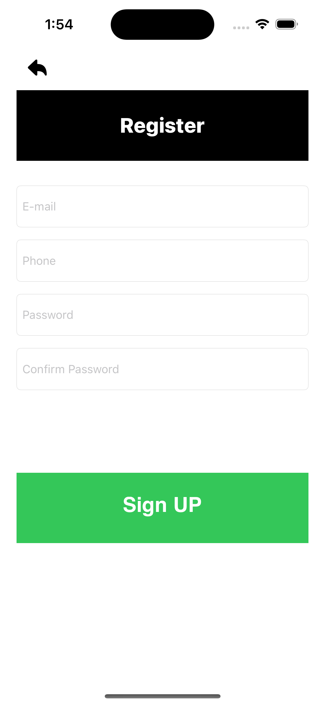

# NavigateBetweenScreens

### 🖼️ Initial Screen  
This is the starting point with the navigation button.


---

### 🖼️ After Navigation  
This is the second screen after transition.



# Screen Navigation Practice

## 📱 Overview
In this project, I learned how to **navigate between screens** in an iOS app using two main approaches:
1. **Storyboard Segues**
2. **Manual Navigation via Code**

This helped me understand UIKit view controller transitions and how to control screen flow.

---

## 🧠 What I Learned

### 1. Connecting a New Screen with Custom Class
- Created a new `UIViewController` file.
- Connected it in **Storyboard** using the **Identity Inspector**.
- Set the **Storyboard ID** to match the class name to enable code-based navigation.

---


### 2. Navigation Between Screens

#### ✅ Method 1: Using Action Segue
- Used **Action Segue** between buttons and view controllers.
- Most common segue types:
  - `Show`
  - `Present Modally`

#### ⚠️ Notes on Full Screen Presentation
- When using `Present Modally` in **Full Screen**, no back button appears by default.
  - Option 1: Add another segue to go back (not ideal).
  - Option 2: Use `dismiss()` function (recommended and cleaner).

---

#### ✅ Method 2: Using Code

```swift
let nextVC = storyboard?.instantiateViewController(withIdentifier: "NextViewController") as! NextViewController
present(nextVC, animated: true, completion: nil)


